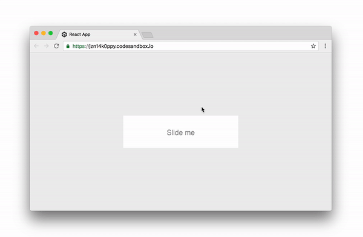

    npm install react-with-gesture
    
Wraps a component into a div that receives MouseDown and TouchStart events, then captures movement until release.

<p align="middle">
  
</p>

Demo: https://codesandbox.io/embed/jzn14k0ppy

* `down`, true on mouse-down or finger-touch
* `x/y`, screen coordinates
* `xDelta/yDelta`, coordinates relative to initial coordinates, great for sliding/dragging gestures
* `xInitial/yInitial`, coordinates of the first click/touch

```jsx
import { withGesture } from 'react-with-gesture'

@withGesture
class Something extends React.Component {
    render() {
        const { down, x, y, xDelta, yDelta, xInitial, yInitial } = this.props
        return <div>Drag me! coordinates: {x}, {y}</div>
    }
}
```

or ...

```jsx
withGesture(
    ({ down, x, y, xDelta, yDelta, xInitial, yInitial }) => 
        <div>Drag me! coordinates: {x}, {y}</div>
)
```

or ...


```jsx
import { Gesture } from 'react-with-gesture'

class Something extends React.Component {
    render() {
        return (
            <Gesture>
                {({ down, x, y, xDelta, yDelta, xInitial, yInitial }) =>
                    <div>Drag me! coordinates: {x}, {y}</div>
                }
            </Gesture>
        )
    }
}
```
